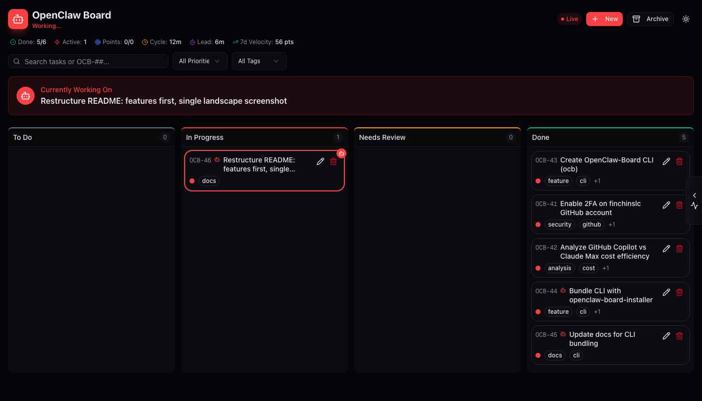

# OpenClaw Board

[](https://www.npmjs.com/package/openclaw-board-installer)

A kanban-style task board for human-AI collaboration, built for [OpenClaw](https://github.com/openclaw/openclaw).

## Features

- 🎯 **Drag-and-drop kanban** — TODO → In Progress → Needs Review → Done
- ⚡ **Real-time updates** — WebSocket-powered live sync
- 🤖 **AI working indicator** — Visual pulse shows what the AI is actively working on
- ✅ **Review workflow** — Tasks go through human approval before completion
- 🔗 **Task dependencies** — Block tasks until dependencies are done
- 📎 **Attachments** — Links, code snippets, and notes on tasks
- 💬 **Comments & subtasks** — Break down work and discuss
- 🏷️ **Human-readable IDs** — Jira-style keys (OCB-1, OCB-2, etc.)
- 🖥️ **CLI included** — `ocb` command for terminal-based task management



## Quick Start

### Option 1: TUI Installer (Recommended)

The easiest way to get started:

```bash
npx openclaw-board-installer
```

This interactive installer will:
- Check prerequisites (Node.js, PostgreSQL)
- Install PostgreSQL via Homebrew if needed (macOS)
- Clone and configure the board
- Set up auto-start on boot (optional)

**Manage your installation:**
```bash
npx openclaw-board-installer status   # Check if running
npx openclaw-board-installer start    # Start the board
npx openclaw-board-installer stop     # Stop the board
npx openclaw-board-installer logs     # View recent logs
npx openclaw-board-installer update   # Pull latest & restart
```

### Option 2: Docker

```bash
git clone https://github.com/finchinslc/openclaw-board.git
cd openclaw-board
docker compose up -d
```

Open http://localhost:3000

### Option 3: Manual Setup

```bash
# Clone
git clone https://github.com/finchinslc/openclaw-board.git
cd openclaw-board

# Install
npm install

# Configure database
cp .env.example .env
# Edit .env with your PostgreSQL connection string

# Initialize database
npx prisma db push

# Start dev server
npm run dev
```

Open http://localhost:3000

### Environment

```bash
# .env
DATABASE_URL="postgresql://user@localhost:5432/openclaw?schema=public"
```

## CLI

The board includes a command-line interface (`ocb`) — automatically installed with the TUI installer, or manually via:

```bash
cd openclaw-board/cli
npm install && npm link
```

### Commands

```bash
ocb list                      # List all tasks
ocb todo                      # Show TODO tasks
ocb show OCB-42               # Task details
ocb create "Fix bug"          # Create task
ocb start 42                  # Start working (sets active)
ocb done 42                   # Mark complete
ocb review 42                 # Submit for review
ocb pick                      # Grab next TODO
ocb active                    # Show current task
ocb comment 42 "Note"         # Add comment
```

### Options

```bash
ocb list --status IN_PROGRESS # Filter by status
ocb list --priority HIGH      # Filter by priority
ocb list --tag bug            # Filter by tag
ocb create "Task" --priority HIGH --tags feature,urgent
ocb pick --priority           # Pick highest priority
ocb show 42 --json            # JSON output
```

### Configuration

```bash
export OCB_API_URL=http://localhost:3000/api  # Default
```

## API

REST API for programmatic task management:

### Endpoints

| Method | Endpoint | Description |
|--------|----------|-------------|
| `GET` | `/api/tasks` | List all tasks |
| `POST` | `/api/tasks` | Create a task |
| `PATCH` | `/api/tasks/:id` | Update a task |
| `DELETE` | `/api/tasks/:id` | Delete a task |

### Examples

**Create a task:**
```bash
curl -X POST http://localhost:3000/api/tasks \
  -H "Content-Type: application/json" \
  -d '{"title": "Build something cool", "priority": "HIGH", "tags": ["feature"]}'
```

**Start working (AI sets this):**
```bash
curl -X PATCH http://localhost:3000/api/tasks/<id> \
  -H "Content-Type: application/json" \
  -d '{"status": "IN_PROGRESS", "isActive": true, "actor": "agent"}'
```

**Submit for review:**
```bash
curl -X PATCH http://localhost:3000/api/tasks/<id> \
  -H "Content-Type: application/json" \
  -d '{"status": "NEEDS_REVIEW", "isActive": false, "actor": "agent"}'
```

### WebSocket

Connect to `/ws` for real-time events:
- `task:created`, `task:updated`, `task:deleted`, `tasks:reordered`

### Webhooks

Send task events to external services (Slack, Discord, etc.) via HTTP POST.

**Configuration (environment variables):**
```bash
WEBHOOK_URL=https://your-endpoint.com/hook
WEBHOOK_SECRET=your-secret            # Optional: for signature verification
WEBHOOK_EVENTS=task.created,task.deleted  # Optional: filter events (empty = all)
```

**Events:**
- `task.created` - New task created
- `task.updated` - Task fields changed (includes `changes` array)
- `task.status_changed` - Task moved between columns
- `task.deleted` - Task deleted

**Payload:**
```json
{
  "event": "task.status_changed",
  "timestamp": "2026-01-30T12:00:00.000Z",
  "task": {
    "id": "abc123",
    "taskNumber": 42,
    "title": "Build feature",
    "status": "DONE",
    "priority": "HIGH",
    ...
  },
  "changes": [
    { "field": "status", "oldValue": "IN_PROGRESS", "newValue": "DONE" }
  ]
}
```

**Headers:**
- `X-OpenClaw-Event`: Event type
- `X-OpenClaw-Delivery`: Unique delivery ID
- `X-OpenClaw-Signature`: HMAC-SHA256 signature (if secret configured)

**Multiple webhooks:** Use `WEBHOOK_URL_1`, `WEBHOOK_SECRET_1`, `WEBHOOK_EVENTS_1`, etc. (up to 5).

## Tech Stack

Next.js · Prisma · PostgreSQL · shadcn/ui · @hello-pangea/dnd

## License

MIT
